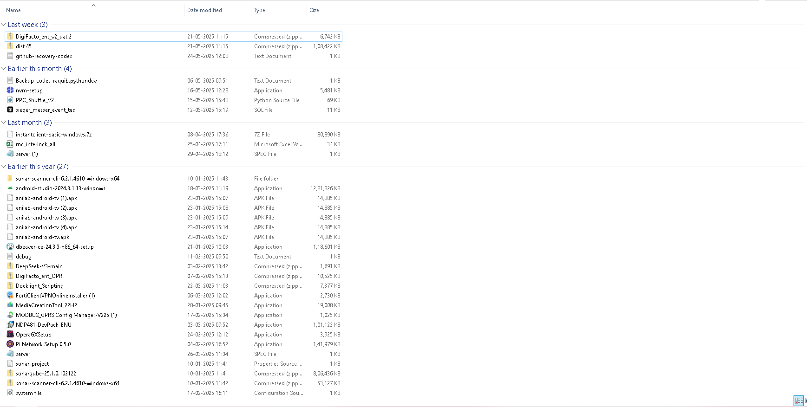
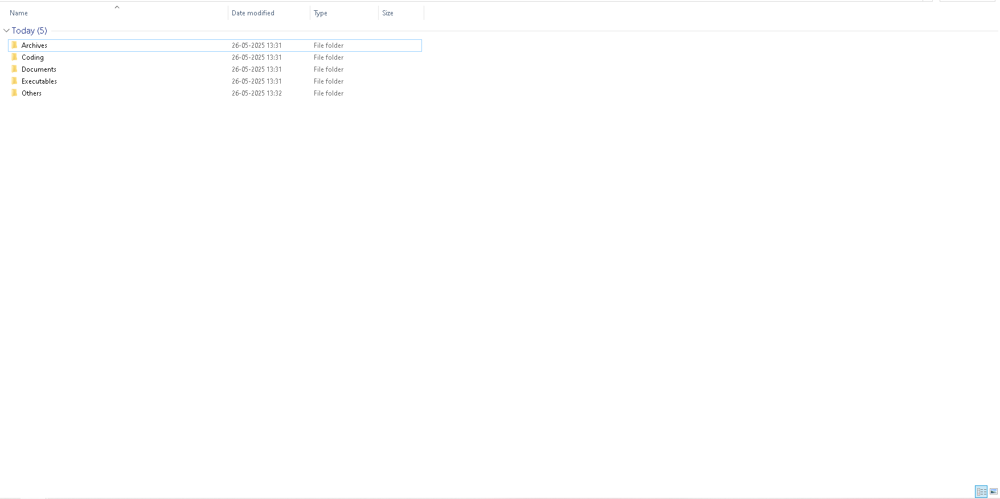
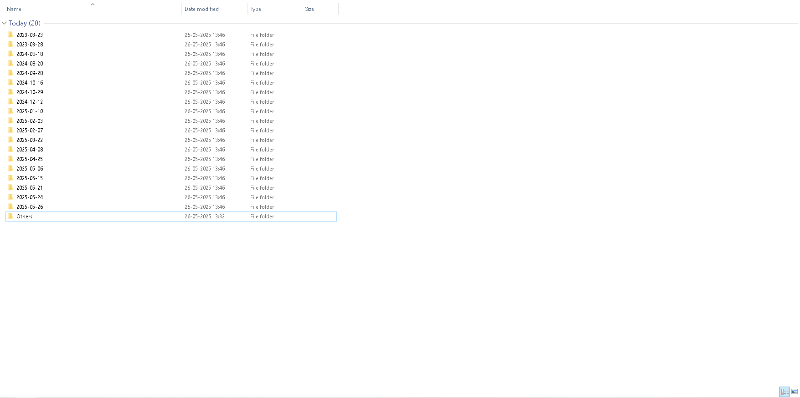
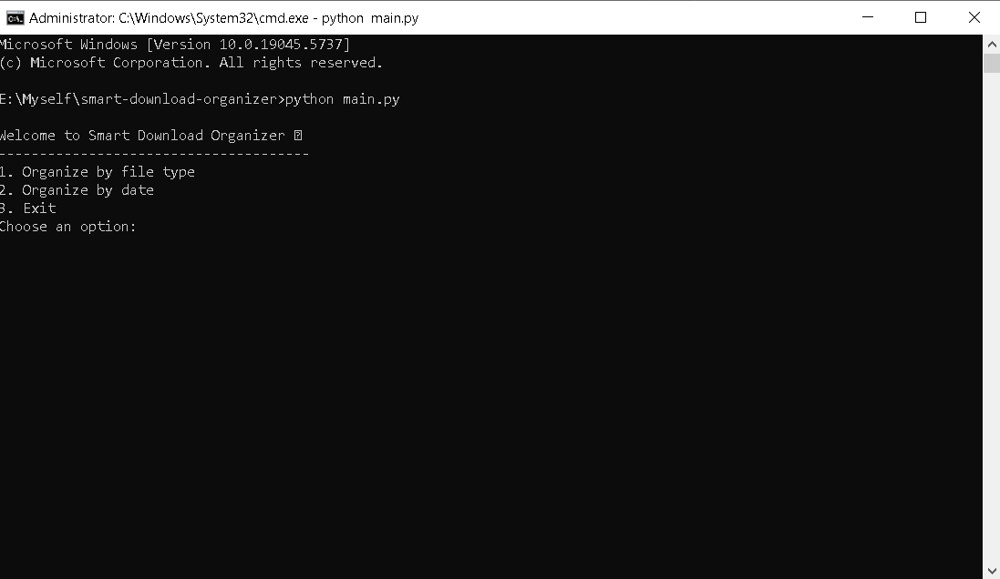

# Smart Download Organizer 📁

A Python-based tool that automatically organizes your cluttered download folders by file type or creation date, helping you maintain a clean and organized file system.

## 🚫 The Problem I Solve

**Does your Downloads folder look like this?**


*A typical cluttered Downloads folder with mixed file types*

We've all been there - your Downloads folder becomes a digital junkyard where files accumulate over time:
- **Mixed file types** scattered everywhere (PDFs next to images, videos mixed with documents)
- **Difficulty finding files** when you need them urgently
- **Wasted time** scrolling through hundreds of unsorted files
- **Digital clutter** that affects productivity and mental clarity
- **No systematic approach** to file organization

Studies show that the average person spends **12 minutes per day** searching for files. That's **73 hours per year** of lost productivity!

## ✅ Solution

Smart Download Organizer transforms chaos into order with two powerful organization methods:

### 1. Organization by File Type
Automatically sorts files into logical categories:
- 📸 **Images**: `.jpg`, `.png`, `.gif`, `.svg`
- 🎥 **Videos**: `.mp4`, `.mkv`, `.mov`, `.avi`
- 📄 **Documents**: `.pdf`, `.docx`, `.txt`, `.xlsx`
- 🎵 **Music**: `.mp3`, `.wav`, `.aac`
- 📦 **Archives**: `.zip`, `.rar`, `.7z`
- 💻 **Coding**: `.py`, `.js`, `.html`, `.css`
- ⚙️ **Executables**: `.exe`, `.msi`
- 📁 **Others**: Everything else


*After organization by file type - clean and categorized*

### 2. Organization by Date
Creates folders based on file creation dates (YYYY-MM-DD format), perfect for:
- **Timeline-based workflows**
- **Project management**
- **Chronological file tracking**
- **Easy backup organization**


*After organization by date - chronologically sorted*

## 🎯 Real-World Use Cases

### For Students 📚
- Separate lecture PDFs, assignment files, and project images
- Organize research materials by subject type
- Keep track of submission deadlines with date-based organization

### For Professionals 💼
- Sort client documents, presentations, and media files
- Maintain clean project folders
- Quick access to specific file types during meetings

### For Content Creators 🎨
- Organize raw footage, images, and audio files
- Separate source files from final exports
- Maintain chronological project timelines

### For General Users 🏠
- Clean up years of accumulated downloads
- Find files faster with logical categorization
- Maintain an organized digital workspace

## 🚀 Features

- **🔄 Two Organization Methods**: File type or creation date
- **📝 Activity Logging**: Track all file movements
- **⚙️ Environment Configuration**: Customizable default paths
- **🛡️ Safe File Handling**: Uses Python's built-in file operations
- **📱 Interactive Menu**: User-friendly command-line interface
- **🔍 Smart Categorization**: Comprehensive file extension mapping
- **📊 Progress Tracking**: Real-time feedback on organization process

## 📋 Requirements

- Python 3.7+
- Dependencies listed in `requirements.txt`

## 🔧 Installation

1. **Clone the repository**
   ```bash
   git clone https://github.com/raquib-dev/smart-download-organizer.git
   cd smart-download-organizer
   ```

2. **Install dependencies**
   ```bash
   pip install -r requirements.txt
   ```

3. **Configure your settings** (Optional)
   ```bash
   # Edit config/settings.env
   DOWNLOAD_PATH=C:/Users/YourUsername/Downloads
   ```

## 💻 Usage


*Interactive menu system*

1. **Run the application**
   ```bash
   python main.py
   ```

2. **Choose your organization method**
   - **Option 1**: Organize by file type
   - **Option 2**: Organize by date
   - **Option 3**: Exit

3. **Select folder path**
   - Enter custom path, or
   - Press Enter to use configured `DOWNLOAD_PATH`

4. **Watch the magic happen!**
   ```
   ✔ Done organizing by file type.
   ```

## 📊 Project Structure

```
smart-download-organizer/
├── main.py                 # Main application entry point
├── utils/
│   └── file_utils.py      # File organization utilities
├── config/
│   └── settings.env       # Environment configuration
├── logs/
│   └── activity.log       # Organization activity logs
├── requirements.txt       # Python dependencies
├── screenshots/           # Documentation images
└── README.md             # This file
```

## 📈 Performance Benefits

**Before Smart Download Organizer:**
- ⏰ 12+ minutes daily searching for files
- 😰 Stress from digital clutter
- 📉 Reduced productivity
- 🔍 Difficulty locating specific file types

**After Smart Download Organizer:**
- ⚡ Instant file location by category
- 😌 Clean, organized workspace
- 📈 Improved productivity
- 🎯 Systematic file management

## 🔒 Safety Features

- **Non-destructive operations**: Files are moved, not deleted
- **Activity logging**: Every action is recorded
- **Path validation**: Checks folder existence before operations
- **Error handling**: Graceful handling of permission issues

## 🛠️ Customization

### Adding New File Categories
Edit `FILE_TYPE_MAP` in `utils/file_utils.py`:

```python
FILE_TYPE_MAP = {
    "YourCategory": [".ext1", ".ext2"],
    # ... existing categories
}
```

### Changing Default Paths
Update `config/settings.env`:
```env
DOWNLOAD_PATH=/your/custom/path
```

## ⭐ Star History

If this project helped you organize your digital life, please consider giving it a star! ⭐

---

**Stop wasting time searching for files. Start organizing smarter today!** 🚀
